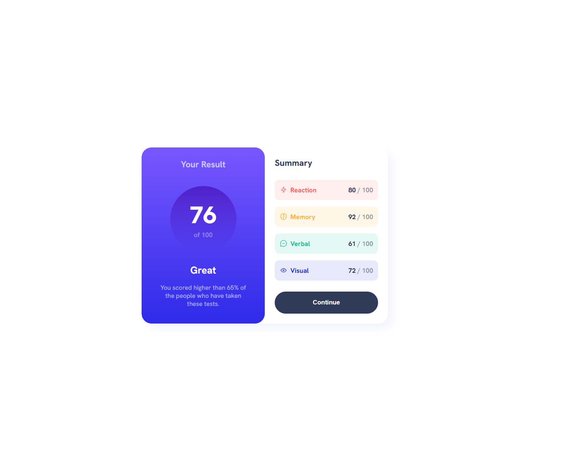
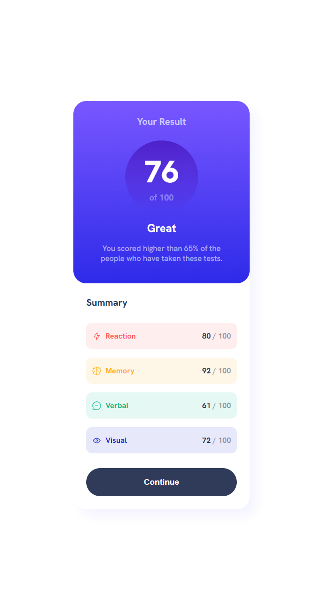

# Frontend Mentor - Results summary component solution

This is a solution to the [Results summary component challenge on Frontend Mentor](https://www.frontendmentor.io/challenges/results-summary-component-CE_K6s0maV). Frontend Mentor challenges help you improve your coding skills by building realistic projects.

## Table of contents

- [Overview](#overview)
  - [The challenge](#the-challenge)
  - [Screenshot](#screenshot)
  - [Links](#links)
- [My process](#my-process)
  - [Built with](#built-with)
  - [What I learned](#what-i-learned)
  - [Continued development](#continued-development)
- [Author](#author)

## Overview

### The challenge

Users should be able to:

- View the optimal layout for the interface depending on their device's screen size
- See hover and focus states for all interactive elements on the page
- **Bonus**: Use the local JSON data to dynamically populate the content

### Screenshot




### Links

- Solution URL: [Add solution URL here](https://your-solution-url.com)
- Live Site URL: [Add live site URL here](https://your-live-site-url.com)

## My process

### Built with

- Semantic HTML5 markup
- CSS custom properties
- Flexbox

### What I learned

- What is the variable font
- How to use the variable font
- How to use the local JSON data to dynamically populate the content

To see how you can fetch a local JSON file see the code snippet below:

```js
fetch('./data.json')
  .then((response) => response.json())
  .then((data) => console.log(data))
```

### Continued development

I will be focusing on the following points in the future:

- How to make the design responsive
- How to use custom reusable classes
- How to choose the right units
- How to choose the right font size
- How to use and modify colors

## Author

- Website - [Asmaa Hamid](https://linktr.ee/asmaa.codes)
- Frontend Mentor - [@asmaahamid02](https://www.frontendmentor.io/profile/asmaahamid02)
